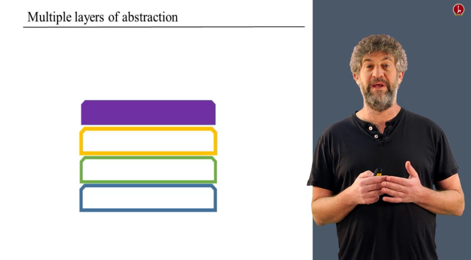
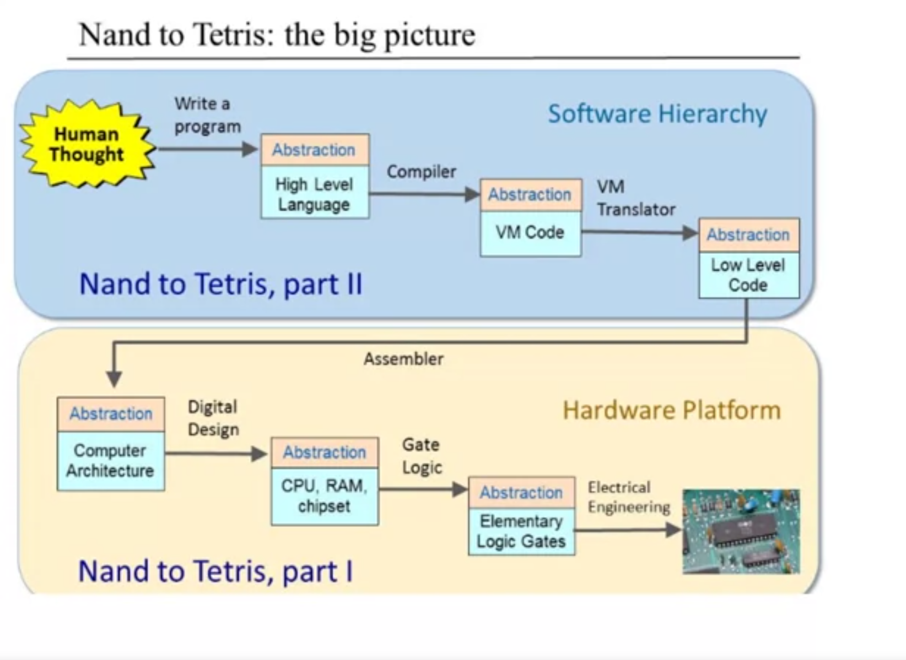
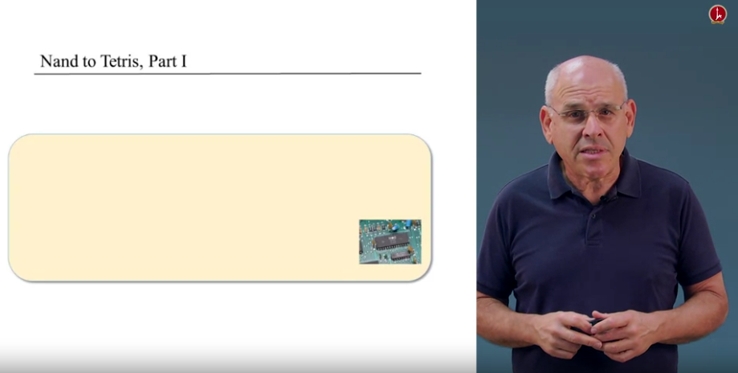
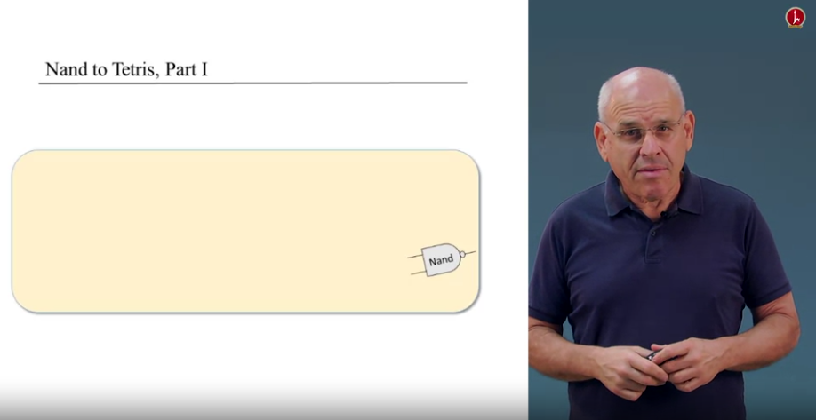
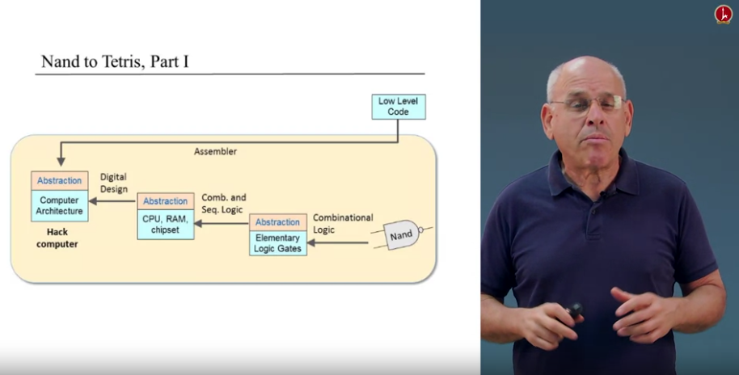
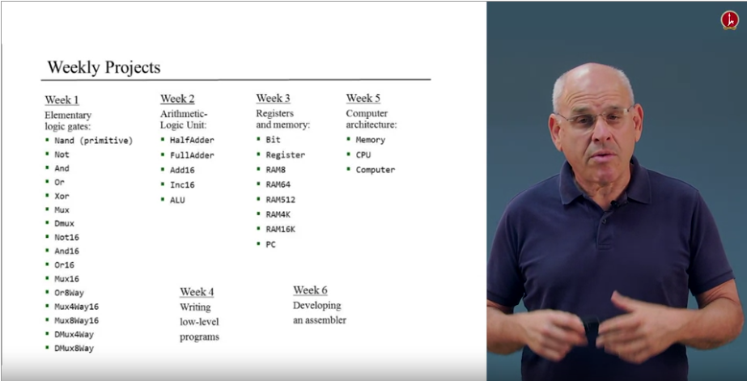
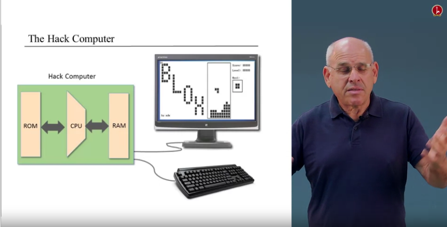

# Introduction

* In this course we are going to build a general purpose working computer from
  the gound up. Hardware and software. 
* In the first 7 weeks we are going to build a hardware of a computer that is
  called `hack`


### Unit 0.1

* Usually all CS courses start with the code below. This is how many start a
  programming course 101. But there is a problem, there are many of things under
  the hood going on.

```
class Main {
  function void main() {
    do Output.printString("Hello World!");
    do Output.println(); // New line;
    }
}
```
* You see a program that has bunch of letters e.g. `p`, `r`, `i`. The letters by
  themselves do nothing. The letters in computer are presented by a number e.g.
  `p = 112`, `r = 114`, `i = 105`

* The simplest command printing `hello world` on the screen involves printing a
  bunch of pixel on the screen. This is extremely complicated thing, but people
  never tell you about how all the stuff works

* The main secret of CS is that you don't have to worry about all the stuff that
  happening in the background when you write a program. You can do and start
  programming without worrying about the basic questions.

> Don't worry about the how only about the what.

* The `how` is the implementation. The `what` is the abstraction = what our
  programming language promises to do. When you learn a programming language
  don't worry about the how, just worry about what it is supposed to do. About
  the `what` and trust someone else to worry about the `how`

* But who is going to worry about the `how`?
  * It could be someone else
  * Or you later or earlier

* If it's later it's good because you can focus on the task now that is using
  the programming language. You can forget all the details of the implementation
  and just remember what is the thing you are doing. That's one of the most
  important things in computer science, that once we can `separate concerns`, we
  can forget a lot of details about implementation and only remember the very
  clean what, a very clean interface and a very clean description of what is
  done there then you get this mental saving of not having to have everything in
  your mind at the same time.

* There are multiple layers of abstraction. Suppose we have built the blue stage
  box, we can forget it's implementation and worry about it's interface when we
  try to implement a green box above. Once we are finished with the green box we
  can forget it's implementation and focus on the interface when we try to
  implement a yellow box etc. This way we have multiple stages, each one of them
  very simple at the end we get complex artifact composed of many simple stages.




* Every week:
  * Worry about a single lever
  * Take the lower level as given (we remember what it does, we forget about how
    we did it)
  * Implement the higher level of abstraction
  * We test that it works
  * We can move to the next week and starting again with the same cycle

> The main thing that you are going to lear here is to work with abstractions. You can forget about the how and only worry about the what. This is the maing thing that we do as programmers

### Unit 0.2

* Now we are going to build a computer that is called `hack`

* Here are the main elements of the computer. It's going to have ROM, CPU, RAM
  and many other chips, once we built this computer we are going to connect to a
  standard keyboard and a display unit. At this time you can start executing
  programs

ROM <----> CPU <----> RAM ---> Display / Keyboard

* Human though -> write the program -> compile it -> we translate it into machine
  language -> we load the code into our computer -> the computer is going to use
  all sorts of chips that we built which are based on the elementary logic gates
  and the whole thing ends up with the hardware itself



* We built a software hierarchy that sits on top of Hardware Platform (that's
  what we're going to build in the course)

* We start at the bottom, at the very low level of everything in applied
  computer science and this actually is not computer science. This is electrical
  engineering and solid state physics and so on. And all sorts of things that
  **the lecturer don't understand** and therefore we're going to abstract away
  the hardware (s. below) 


* And focus instead of the most elementary logic gate that we can think of which is called `nand`



* `Nand` is a logic gate, we take this gate and from it using a ceration art
  called combinational logic we are going to build a whole set of elementary
  logic gates like `and` `or` `xor` and so on.

* Then we'll take this gates and from there we are going to use both
  combinational logic and sequential logic which is a different art of design
  which takes into consideration time and clocks and from it we are going to
  build registers and RAM units and CPU.

* And then we'll take the chip set that we built and we'll design from it a full
  blown computer architecture called hack.

* In order to write programs that can execute on this machine and do it in a
  convinient way, we are going to introduce an assembler and we're going to
  develop an assembler for the hack machine language



* Hardware engineers today don't develop hardware with the hands. They use
  hardware simulator to test, design and debug the hardware that they want to
  build. We'll do all the projects in this course by using the
  HardwareSimulator.sh supplied with the course materials.

#### Building a chip: design

1. We start with an abstract description of the chip e.g. Xor: outputs 1 if
   exactly one of its inputs is 1, otherwise outputs 0

2. We take the abstraction, think about it and we'll come up with some logic
   diagram. That enables you to build Xor using lower level gates that you built
   before

3. Then you'll take this diagram and specify it using a language which is called
   HDL program (Hardware description language). The result will be HDL program,
   you will take this HDL program, combine it with some test scripts and then
   we'll debug, test and compelete the HDL program using the HardwareSimulator

* This is how we're going to build a computer by building chips every week



* This is what the result will be. A working computer that can run every program
  we want


